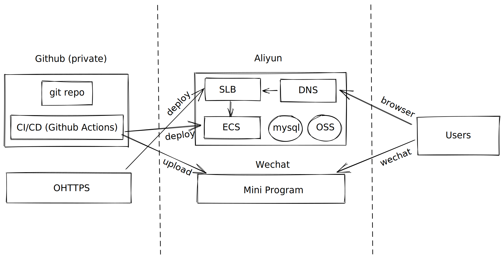

# 2021 高性价比 web 开发方案总结(未完结)

## 需求

以一个 todo 项目为例，假设有以下需求：

- 能通过浏览器管理 todo 清单
- 能通过微信小程序管理 todo 清单

于是有了这样几个端：

- 后端，提供 api
- 浏览器端
- 微信小程序端

## DevOps 选型

按照惯例，先解决三个问题：

- 代码管理
- CI/CD
- 运维

考虑到低成本，应该尽量选择大的平台，避免自己搭建。

### 代码管理

